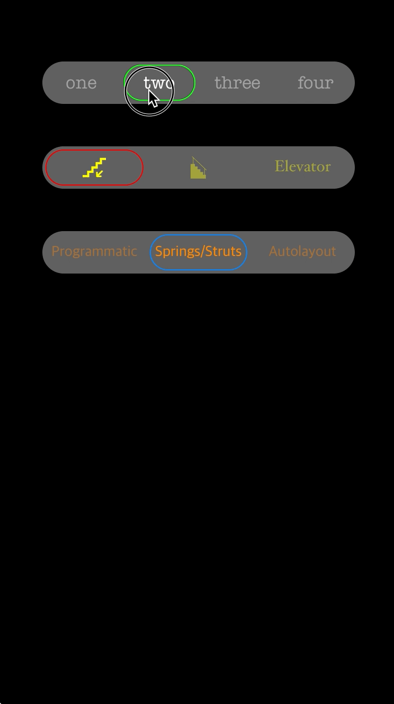

DNSCastroSegmentedControl
=========================

A segmented control based on the one in the [Castro](http://castrofm.com) settings page. 

##Features

- Can display images or text
- Background, text/image, and selection colors customizable
- Fonts for text customizable
- Automatically responds to bounds changes, so rotation or other bounds changes are handled easily. 
- Compatible with iOS 7+. 

##//TODOs
* ??? - File an issue!

##Images

Images used in the sample app are Creative Commons via [The Noun Project](http://thenounproject.com/).